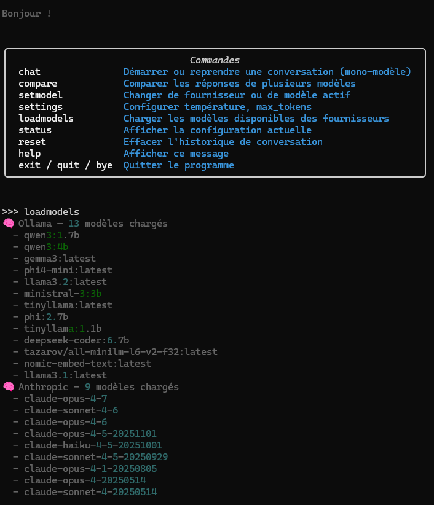
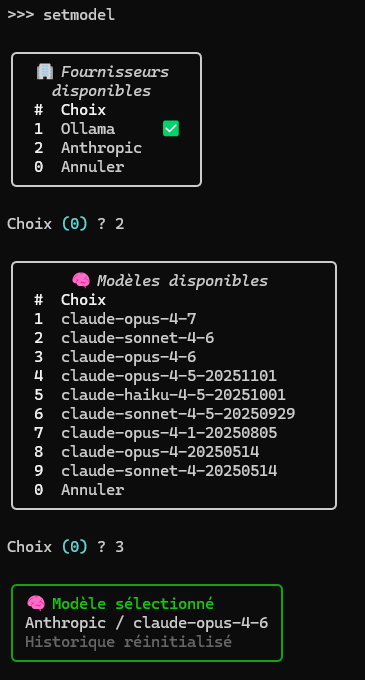
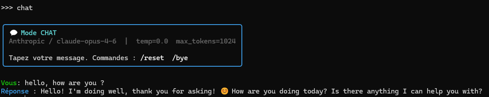
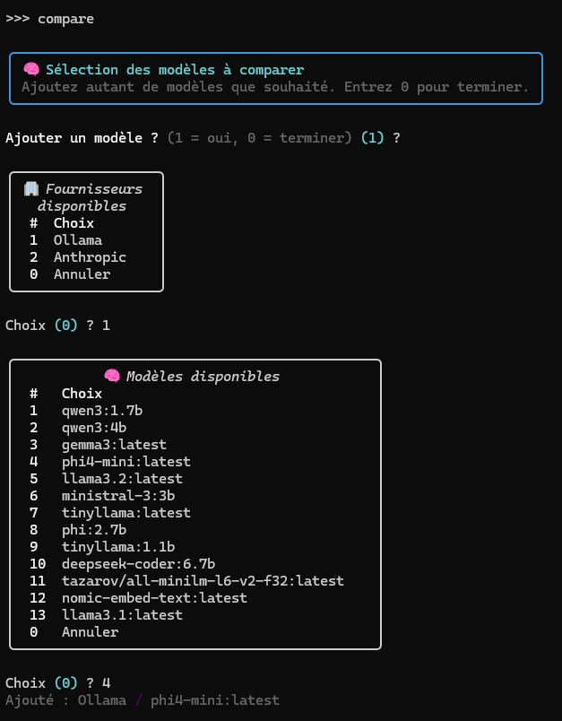
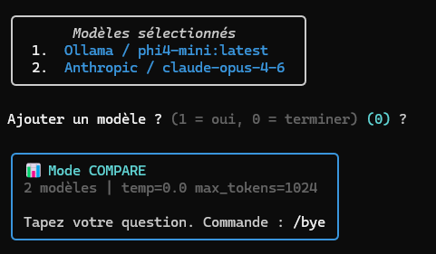
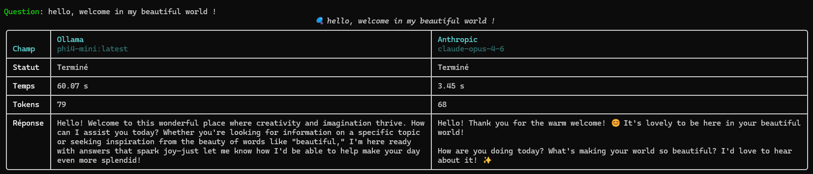

# Exploring Mozilla AI libs

> Some examples for [any-llm](https://github.com/mozilla-ai/any-llm), [any-agent](https://github.com/mozilla-ai/any-agent), [any-guardrail](https://github.com/mozilla-ai/any-guardrail), ...


## Exploring...

> The AI specific functions are declared in [ai.py](ai.py) file.

* First, configure the `.env` file:
```bash
# Model providers (comma-separated list of providers)
PROVIDERS=ollama,anthropic

# Provider and model to use by default
DEFAULT_MODEL=ollama/ministral-3:3b

# Other LLM parameters
DEFAULT_TEMPERATURE=0.0
DEFAULT_MAX_TOKENS=1024

# Ollama configuration (if not localhost)
OLLAMA_HOST="http://example.com:11434"

# Provider keys
ANTHROPIC_API_KEY="sk-ant-..."
```

* Then, launch [exploring-any-llm.py](exploring-any-llm.py): with `any-llm`, the same code for any LLM providers, that's great !
  * Load the models:



  * Select the model for the chat:



  * Chat:



  * Compare models - choose the models:




  * Compare models - ask something et see the result:




## TODO

* [ ] Translate into english (désolé...)

